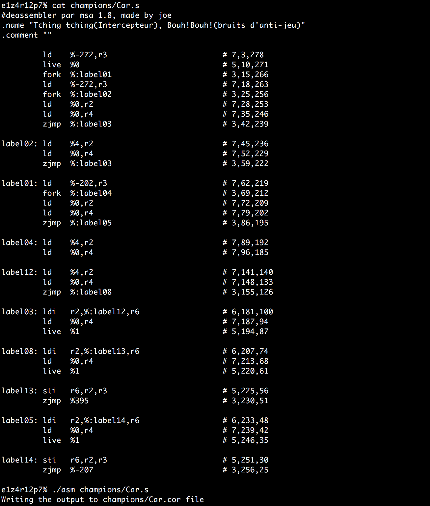
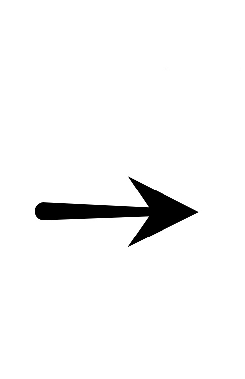
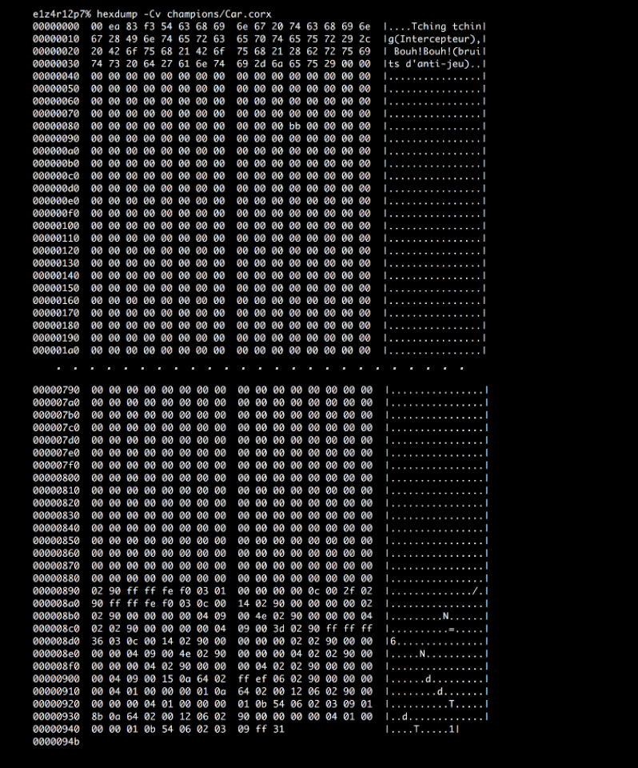

# Corewar ⚔️🤺

Core War is a 1984 programming game created by D. G. Jones and A. K. Dewdney in which two or more battle programs (called "warriors") compete for control of a virtual computer. These battle programs are written in an abstract assembly language called Redcode.
 

## There are three parts Corewar can be broken down into:
* [**The assembler**]
* [**The virtual machine**]
* [**The champion**] 
 

## The Assembler

  
  
  

 

 

## ## The Virtual Machine

 
